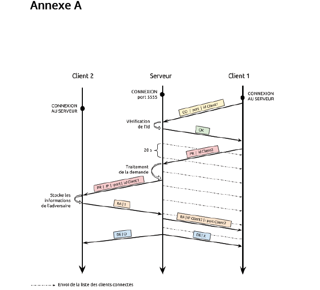
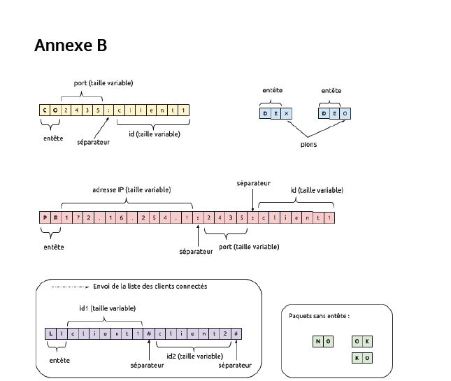

 
 
 
 
 
 
Université Paris Diderot 
 
# Protocoles des services Internet Spécification 
# Projet : Jeu multi-joueurs en réseau 

 
# Connexion Client ↔ Serveur en TCP 
 
# Le protocole 
(cf. Annexe A) 
 
## Le serveur se met en attente de clients sur le port 5555 
## Le client se connecte au serveur 
 1. Le client envoie un message de la forme “COportid”​ avec port​ son port d’écoute UDP et id​ son pseudo.​  
 2. Le serveur répond “OK”​ si la connexion a été établie et “KO”​ sinon (et la socket du serveur associée au client est fermée) 
 
## Le serveur envoie régulièrement la liste des clients (20s) 
 1. a En-tête de liste LI​ ,​ puis les pseudo des clients séparés par un #​ (également après le dernier pseudo) 
 2. Si erreur d’envoi, le serveur retire le client de la liste. Il y a 2 cas de “close”: 
   -  Volontaire (fermer le programme, freeze, fin du monde…) 
   - Début de partie (envoi d’un paquet de déconnexion aux joueurs concernés) 
 
## Le client demande au serveur la possibilité de jouer : 
 1. Il envoie un paquet “PRid”​	 où ​ id​ est le pseudo de l’adversaire voulu.​
	Si l’adversaire n’existe pas, le serveur se contente d’envoyer “NO”​ .​ Par contre, il ne déconnecte pas le client. 
 2. Le serveur envoie la requête au client destinataire, c’est-à-dire un paquet “PRxxx.xxx.xxx.xxx:yyyy:id” avec id​ l’identifiant de l’emetteur précédé de son adresse IP et de son port UDP 
 3. c Le client destinataire répond au serveur avec un paquet “RA1”​	 (accepte) ou 
	“RA0” (refus)​	
   - Si “RA1”​	 : le serveur envoie le paquet “RAxxx.xxx.xxx.xxx:yyyy”​	
(IP:portUDP) au client qui a fait la demande de jeu 
   - Si “RA0”​ : le serveur envoie le paquet “NO”​ (plus de taille de paquets, les 0​ deviennent inutiles)​	
 
## Si tout est OK : 
le serveur envoie un paquet de déconnexion “DEX”​ ou “DEO”​ (‘O’​ et ‘X’ sont les pions) 
fermeture des sockets TCP (serveur et clients) 
après l’échange, les clients connaissent IP et port UDP de leur adversaire ainsi que leur pion (‘O’​ commence, il faut bien choisir)​	
 
# Format des messages 
(cf. Annexe B) 
 
Les paquets se terminent tous par ‘\n’​ .​ On ne pose pas la question de la taille des données. 


| Entete | Argument | Emetteur | Usage |
| :--- | :---: | :---: | ---: |
| CO | port:id | Client | Connexion du client au serveur |
| OK | / | Serveur | Connexion acceptée |
| KO | / | Serveur | Connexion refusée |
| LI | String | Serveur |Envoie la liste des clients| 
| PR (​ play request) | String id Client(1) |Demande de jeu pour le client id |
| PR (​ play request) | String “xxx.xxx.xxx.xxx:yyyy:id” | Serveur |Demande de jeu par le client id | 
| NO | / | Serveur | Le joueur demandé n’existe pas ou il a refusé l’invitation | 
| RA (​ request ans) | char ‘0’ ou ‘1’ | Client(2) |Accepte ou refuse l’invitation | 
| RA (​ request ans) | String “xxx.xxx.xxx.xxx:yyyy”  ^ /!\ tailles de IP et port --- variables |  Serveur | Résultat de la requête |
| DE (​ déco) | char ‘X’ ou ‘O’ | Serveur |Prévient les clients qu’ils vont être déconnectés du serveur TCP tout en leur donnant leur pion (on sait qui commence) |


|	|A	|B	|C    |
| :--- | :---: | :---: | ---: |
|1     |       |       |      | 
|2     |       |       |      |
|3     |       |       |      | 







# installation

===================================INSTALATION====================================

Se placer dans le dossier source et faire

```make ```

===================================NETOYAGE======================================

supprime les .class

```make clean ```

==================================EXECUTION======================================

pour lancer un serveur

```java Serveur ```

pour lancer un client

```java Client ```

